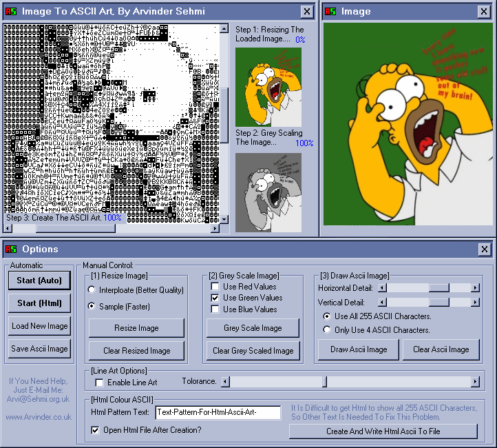



## ASCII Art Creator \(Version 4 \- Html,  Last Update: Nov 06 2000\)

### Description

This App Will Load An Image, Resize It, And Then Grey Scale It. It Will Then Redraw The Image, But Not Using Pixels, Using Text!(ASCII Characters) You Can Get Some Cool Effect Doing This, But I'm Not Sure If It Will Be Of Use To Anyone. (When Viewing The Images, It Is Best To Do It In Notepad, With The Font Terminal.)

Now Includes Progrss Indicators.

Now Has Faster Resize Sub (Uses Stretch Blt)

Can Now Create Coloured Html Art!!!

Now
 
### More Info
 
An Image (One Supplied)

When Viewing The Images, It Is Best To Do It In Notepad, With The Font TERMINAL.

A Cool Looking Image Made Out Of Text

             |
---                |---
**Submitted On**   |2000-11-06 16:46:28
**By**             |[Arvinder Sehmi](https://github.com/Planet-Source-Code/PSCIndex/blob/master/ByAuthor/arvinder-sehmi.md)
**Level**          |Advanced
**User Rating**    |4.8 (710 globes from 147 users)
**Compatibility**  |VB 5\.0, VB 6\.0
**Category**       |[Graphics](https://github.com/Planet-Source-Code/PSCIndex/blob/master/ByCategory/graphics__1-46.md)
**World**          |[Visual Basic](https://github.com/Planet-Source-Code/PSCIndex/blob/master/ByWorld/visual-basic.md)
**Archive File**   |[CODE\_UPLOAD113751162000\.zip](https://github.com/Planet-Source-Code/arvinder-sehmi-ascii-art-creator-version-4-html-last-update-nov-06-2000__1-10344/archive/master.zip)

